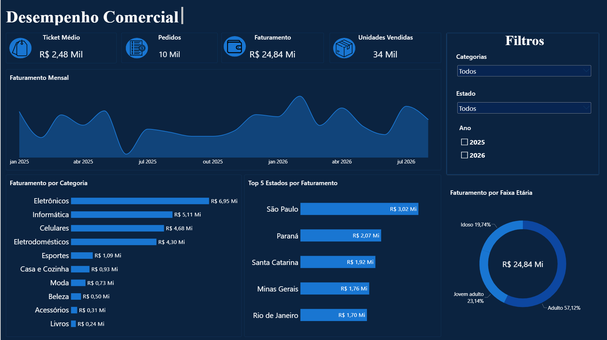

# 📊 Dashboard de Desempenho Comercial | E-commerce (Power BI)

Dashboard interativo desenvolvido no Power BI para análise de desempenho comercial de um e-commerce (dados fictícios), como projeto de portfólio voltado a vagas de analista de dados.

## 🎯 Objetivo

Consolidar as principais métricas de vendas em um painel único e interativo, permitindo cruzar faturamento por categoria de produto, estado e faixa etária do público, com filtros combinados para exploração livre dos dados.

## 🖼️ Preview

> Substitua `dashboard-preview.png` pelo print final do dashboard, salvo na mesma pasta deste README.

## 🛠️ Ferramentas utilizadas

- **Power BI Desktop** — modelagem e visualização
- **DAX** — medidas customizadas (faturamento por ano, variação percentual)
- **PostgreSQL** — base de dados de origem

## 📈 Indicadores principais

| Métrica | Valor |
|---|---|
| Faturamento total | R$ 24,84 Mi |
| Pedidos | 10 Mil |
| Ticket médio | R$ 2,48 Mil |
| Unidades vendidas | 34 Mil |

## 🔍 Funcionalidades

- Filtros interativos combinados: **Categoria**, **Estado** e **Ano**
- Evolução do faturamento mensal (jan/2025 a ago/2026)
- Faturamento detalhado por categoria de produto
- Ranking dos 5 estados com maior faturamento
- Segmentação de faturamento por faixa etária do público
- Identidade visual própria: ícones customizados e paleta de cores consistente

## 💡 Principais insights

- **Eletrônicos** é a categoria líder, respondendo por ~28% de todo o faturamento
- O público **Adulto** concentra 57% do faturamento — mais que o dobro da segunda maior faixa etária (Idoso)
- **São Paulo** lidera isoladamente o faturamento por estado, à frente de Paraná e Santa Catarina

## 📁 Sobre os dados

Os dados utilizados são fictícios, estruturados em um banco relacional (PostgreSQL), com tabelas separadas para pedidos e localidades, entre outras — permitindo consultas mais organizadas e evitando repetição de informação (normalização).

## 🧠 Desafios técnicos superados

- Correção de um problema de geolocalização no mapa por estado, causado por inconsistência de acentuação entre a base de dados e o arquivo TopoJSON utilizado
- Construção de medidas DAX para comparação de faturamento entre períodos
- Ajustes de formatação e camadas de visuais para garantir consistência visual em todo o painel

---

📫 Aberto a feedbacks! Sinta-se à vontade para abrir uma *issue* ou entrar em contato.
